# The Planeteers
Visit the deployed website: [The Planeteers](https://rvn-r.github.io/the-planeteers/index.html).

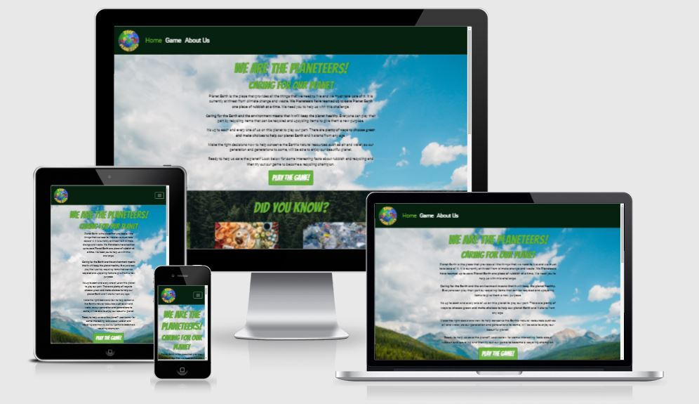

## Table of Contents
1. [User Experience (UX)](#user-experience-UX)
    1. [Project Goals](#project-goals)
    2. [User Stories](#user-stories)
    3. [Color Scheme](#color-scheme)

2. [Features](#features)
    
3. [Technologies Used](#technologies-used)
    1. [Language Used](#language-used)
    2. [Programs Used](#programs-used)
    
4. [Testing](#testing)
    1. [Testing User Stories](#testing-user-stories)
    2. [Manual Testing](#manual-testing)

5. [Deployment](#deployment)

6. [Cloning](#cloning)

7. [Credits](#credits)

8. [Acknowledgements](#acknowledgements)

## User Experience (UX)
 

### Project Goals
Our goal of the project was to design and create an informative, fun, interactive website and bring knowledge and awareness of how important it is to take care of our planet, not just for our generation, but for the generations ahead.- The website contains our group logo, “The Planeteers”, “Home”, with “Game” and “About Us” linking to additional pages. Also, each page consists of a matching footer page with social networking links, blue for recycle and turn green on hover, for the user going the “green” option to find out more. The social networking links are set for their respective home pages for the moment. Additional links are provided for other external sources used.- The Home page consists of 3 sections that are “Air”, “Land” and “Water”.  

* **AIR**: Clean air to breath.  
* **LAND**: Good land to grow crops.  
* **WATER**: Clean, fresh water to drink. Conserving our natural resources, air, land and water quality.

 

#### The Planeteers, “Caring for our Planet”

### User Stories
#### First Time Visitor Goals

 
1. As a First Time Visitor, I want to easily understand the main purpose of the site, and learn more about the game.

  

2. As a First Time Visitor, I want to be able to easily navigate through the site to find key content.

  

3. As a First Time Visitor, I want to clearly find out how play the game.

  

4. As a First Time Visitor, I want learn useful and informative facts on the benefits of recycling.

#### Returning Visitor Goals

1. As a Returning Visitor, I want to navigate to the game page quickly.

  

2. As a Returning Visitor, I want to learn about the team behind the site and game.

#### Frequent User Goal

1. As a Frequent User, I want to be able access the sources of the facts featured on the home page, so I can learn more on the subject.

 

### Color Scheme
From the outset of building this site we wanted to take its key design features from the colours of nature. The colours we used on the site had to reflect the sites demographics values, that of improving the environment. Using as a team we collaborated on what colour scheme would aid us in connecting with our intended audience. To achieve this we used a website called [Coolors](https://coolors.co/), experimenting with difference colour pallets ultimately settling on the below list of colours:

* #1f6fa4 - Honolulu Blue

* #246F75 - Ming

* #072110 - Phthalo Green

* #236823 - Pakistan Green

* #64B334 - Green Ryb

 

### Typography

Bangers and Rubik are the two fonts we have chosen for use across the site. We wanted the site to appeal to a younger audience, while including content to help improve an older demographics (parents/carers of said younger audiences) understanding of recycling and methods to help improve the environment. This was a tricky task and a difficult balance to find, but both fonts with there child like and comic book features helped us appeal to our younger demographic. 

 

### Wireframes
[Balsamiq](https://balsamiq.com/) was used to create the wireframes.

See Mobile wireframes

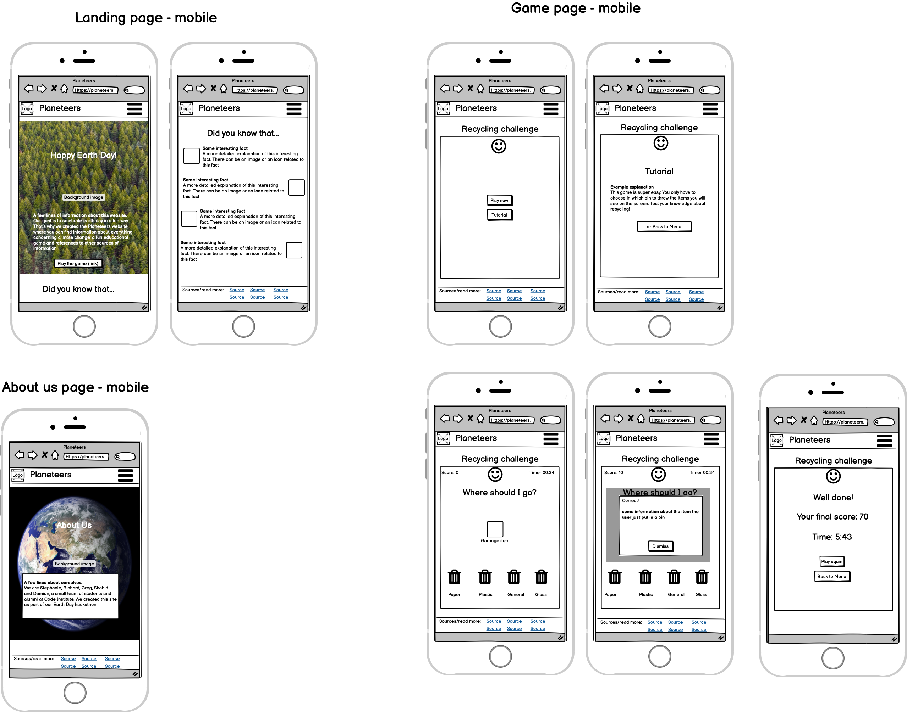

See Tablet Wireframes

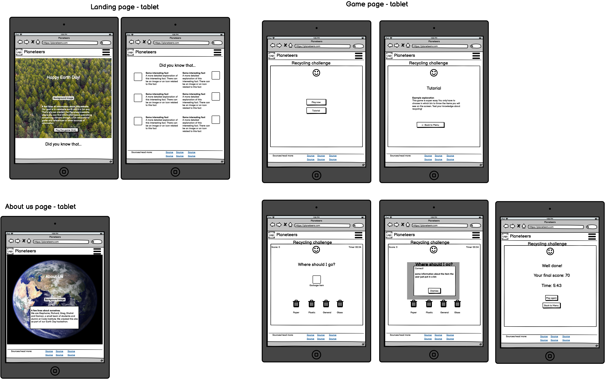

See Desktop Wireframes

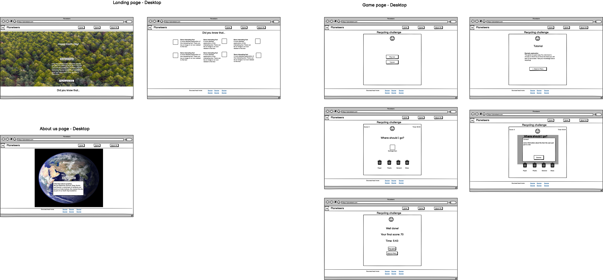

[Back to top ⇧](#the-planeteers)

 

### Features
The game consists of different items that the player needs to put in the correct bin.
The features of the game are:
- A Play button that triggers the game itself
- A Tutorial button that explains how to play the game. From the tutorial it's easy to go back to the main menu.

See screenshot of game main menu and tutorial

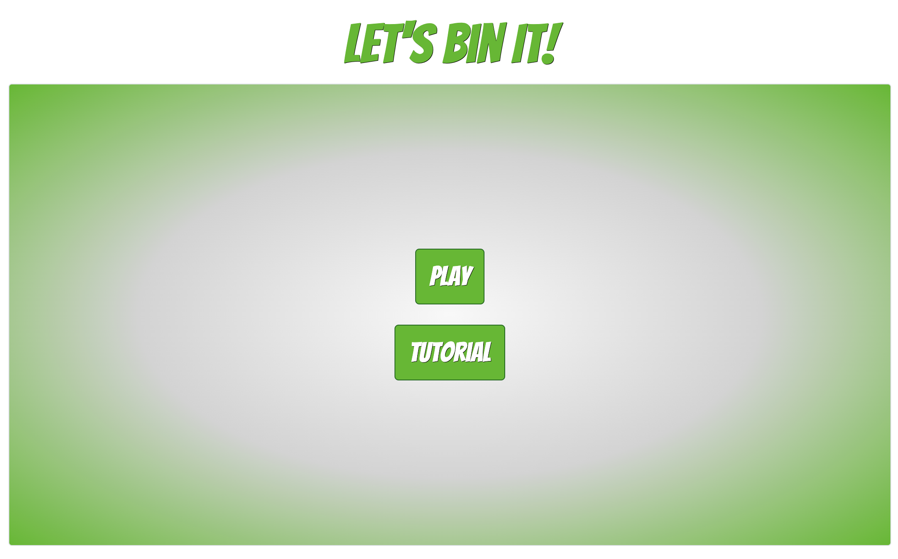
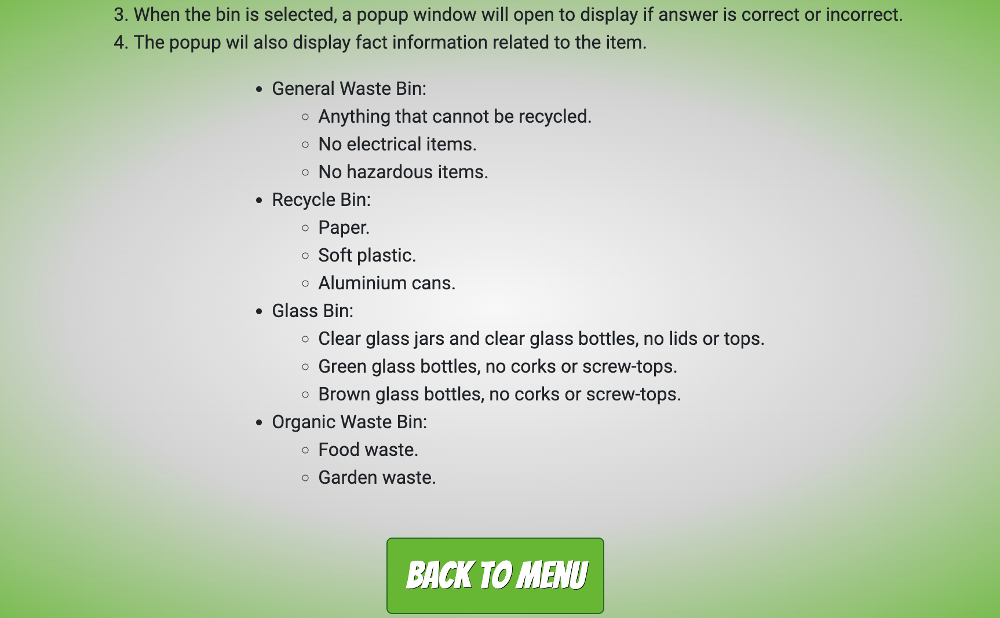

- The player can easily keep track of their score, which is displayed in the top left corner of the game area
- In the top right corner of the game area, the player can keep track of the number of questions they already answered
- The player can click on any of the bins in the bottom area of the game to decide where to throw the item currently on display.

See screenshot of the game's main area

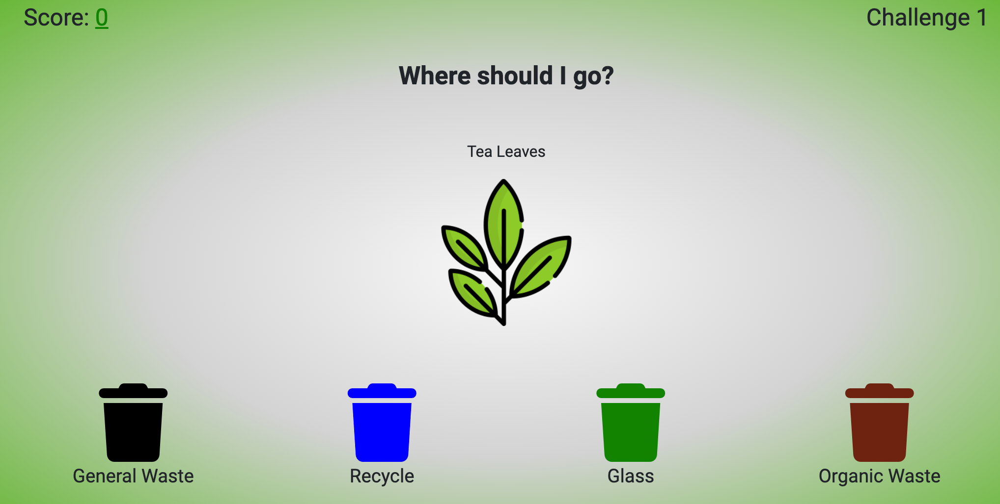

- The player will receive detailed feedback on their choice, and will have the opportunity to learn more about recycling in the modal that pops up after clicking on a bin

See screenshots of the game's feedback modals

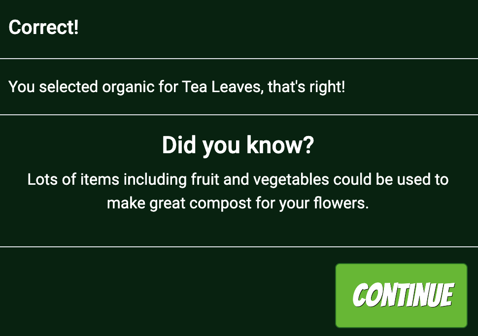
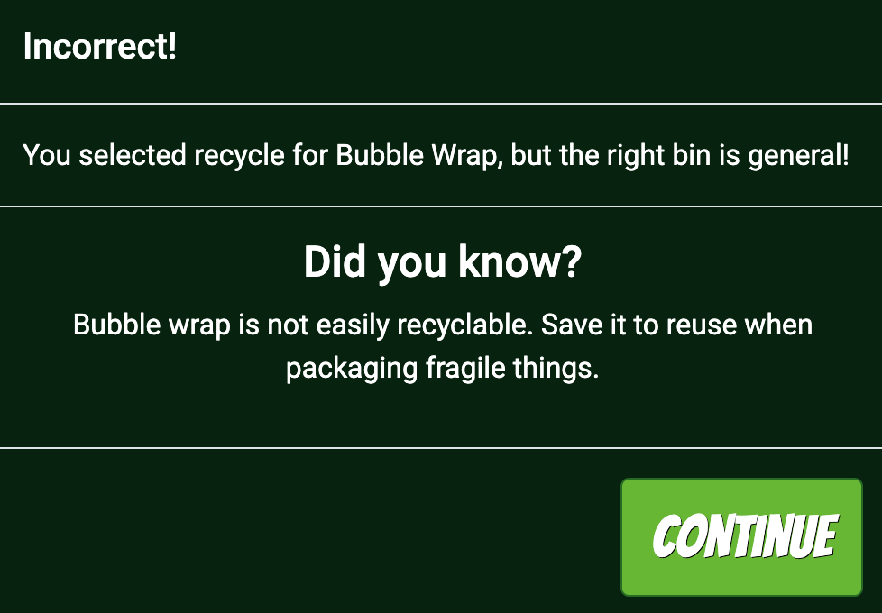

- At the end of the game, the player will see their final score and have the choice to either play a new game, go back to the game menu or go back to the Homepage.

See screenshots of the game over view

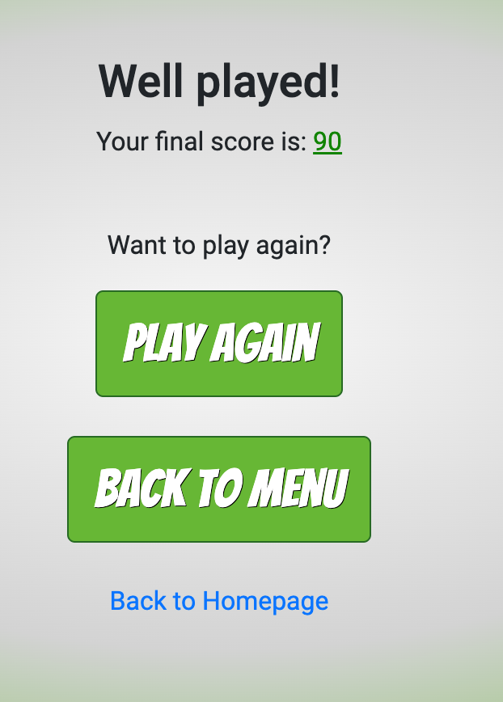

 

### About Us page
The about us page tells a bit more about each member of the planeteers and contains information about our goal.

See screenshots of the about us page

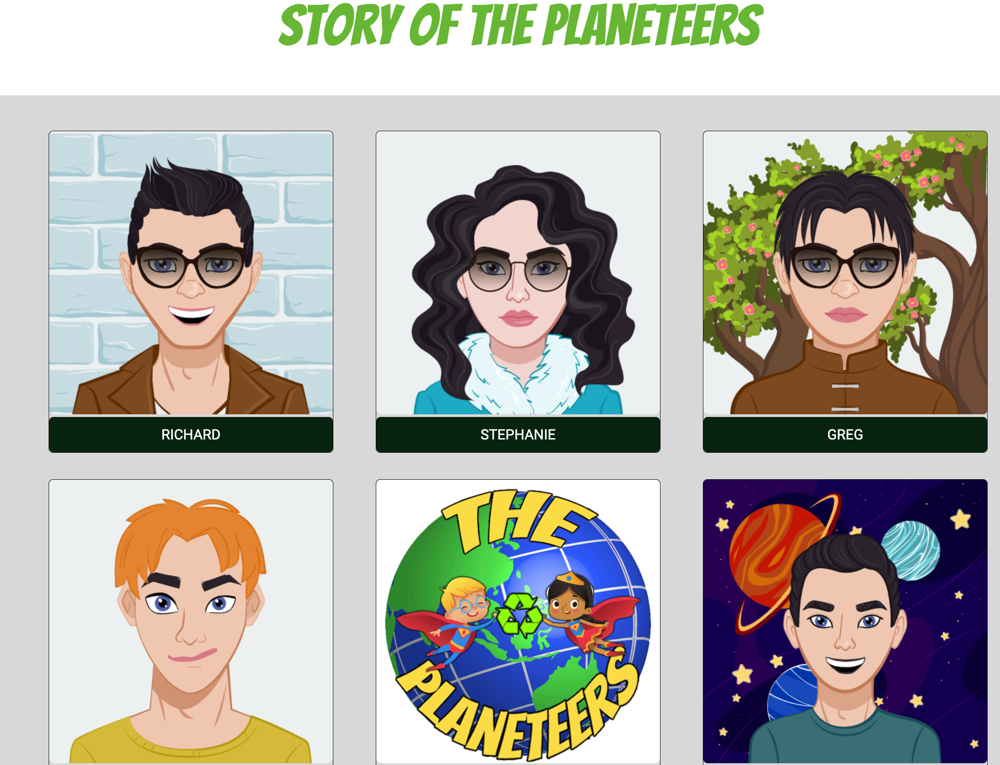
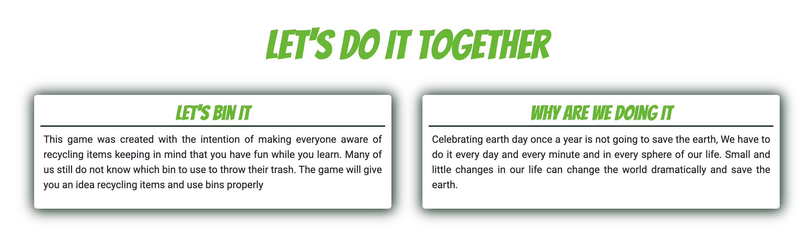

 

### Future Features
 The possibility to save the player's name in a scoreboard

 

## Technologies Used

 

### Language Used
* [HTML 5](https://en.wikipedia.org/wiki/HTML5)

* [CSS 3](https://en.wikipedia.org/wiki/CSS)

* [JavaScript](https://en.wikipedia.org/wiki/JavaScript)

### Frameworks, Libraries & Programs Used
* [Bootstrap 4.6](https://getbootstrap.com/docs/4.6/getting-started/introduction/) was used to assist with the styling of the site and particularly the responsiveness.

* [Hover.css](https://ianlunn.github.io/Hover/) was used to apply hover effects.

* [jQuery](https://jquery.com/) was used for some of the Bootstrap components and also in the custom JS used throughout the site.

* [Google Fonts](https://fonts.google.com/) was used for the Bangers and Roboto fonts.

* [Font Awesome](https://fontawesome.com/) was used for all the footer icons and game bin icons.

* [Coolours](https://coolors.co/) library was used to design the colour scheme for the site.

* [GitPod](https://gitpod.io/) was used for collaborating the group project in writing code, committing to branches and after approval, merging to main on GitHub.

* [GitHub](https://github.com/) was used to store the project after pushing the code.

[Back to top ⇧](#the-planeteers)

## Testing User Stories from UX section in README

 

### Testing First Time Visitor Goals

1. **As a First Time Visitor, I want to easily understand the main purpose of the site, and learn more about the game.**

-   At the top of the Home Page is a paragraph informing the visitor of the sites and games values. With regard to learning more about the game, once the user clicks "Game" in the navigation bar there is a call to action button titled "Tutorial". Once clicked a modal appears explaining the rules of the game. 

2.  **As a First Time Visitor, I want to be able to easily navigate through the site to find key content..**

-   At the top of each page is a navigation bar that runs the length of the page. It's fixed at the top of the page and allows the visitor, no matter where they are on the website, to know the location of the navigation bar.

3.  **As a First Time Visitor, I want to clearly find out how play the game**

-   Once the user arrives at the home page they will be presented with two call to action buttons, one entitled "Game" and the other entitled "Tutorial". By clicking the call to action button titled "Tutorial" a modal appears explaining the rules of the game. 

4.  **As a First Time Visitor, I want learn useful and informative facts on the benefits of recycling**

-   When the user arrives at the home page when they scroll down the page they will see very clearly in Bangers font the headings "Did You Know?" and "How Can You Make a Difference?". Each heading is in its own section with different background images. These images help clarify to the visiter that these sections cover different topics. Underneath each heading are four cards, with interesting facts, and images relating to these facts. The facts themselves are small, easy to understand and provide real value to visitor of the site. 

 

### Testing Returning Visitor Goals

 

1.  **As a Returning Visitor, I want to navigate to the game page quickly.**

-   We have fixed the navigation bar to the top of the site, meaning no matter where the user is on the site they will be able to easily navigate around the site.

2.  **As a Returning Visitor, I want to learn about the team behind the site and game**

-   The user can easily navigate to the About Us page using the onsite navigation. Once on the About Us page the user will see six cards with hover effects. Once the user hovers over the images of our avatars information on each team member and the overall team will appear. 

 

### Testing Frequent Visitor Goals

 

1.  **As a Frequent User, I want to be able access the sources of the facts featured on the home page, so I can learn more on the subject.**

-   The validity of the facts we have included on our site was of paramount importance to us. Not  only because we want to make sure what we are informing the users of our site is correct, but to also provide them an opportunity to further read up on the subject should they find it interesting. At the bottom of each page
- 
 

### Manual Testing

Continuous manual testing was carried out throughout the development process with display or functionality errors corrected as they appeared. Detail of some of the manual testing is listed below. The testing has been carried out on both desktop and mobiles:

 

**Navigation Bar**

* All navigation bar links work correctly.

* The logo animation works as expected.

**Footer**

* The social media links take the user to the correct page and open in a new tab.

* The sources links take the user to the correct page and open in a new tab.

**Homepage**

* The Play The Game button takes the user to the correct page.

* The fact card animation works as expected.

* All images and text are displaying correctly.

**About Us Page**

* The person card hover effects work as expected.

* The text and images are displaying correctly on large and small screens.

* There is an unfixed bug with the person text extending outside the container on medium screens.

**Game Page**

* The play, tutorial and back to menu buttons work as expected.

* The fact modal launches when a bin is clicked and the continue button dismisses it.

* The correct information is displayed on the fact modal.

* The correct colour bin outline is displayed to indicate correct or incorrect answer.

* Score increments as expected with correct answers and the challenge number increments.

* Play again, back to menu and back to homepage links work as expected at the end of the game. 

[Back to top ⇧](#the-planeteers)

 

## Deployment

 

### GitHub
The website has been deployed using GitHub Pages by following these steps:
1. Confirmed that correct repository name is selected as: 'the-planeteers'
2. Select 'Settings'
3. Scroll down to 'GitHub Pages' and click on 'Check it out here!'
4. On the 'Source' section, select Branch as 'main' and click on 'Save'.
5. Your site is published at https://rvn-r.github.io/the-planeteers/index.html/

 

### Gitpod
1. For deployment of the website to a local environment, the following steps were required:
2. Confirmed that correct repository is selected as 'the-planeteers'
3. To run a new Python server, open a terminal window and type the following code and hit enter:
    - python3 -m http.server
4. Once the Python server is running, you will be prompted to open a browser on port 8000 to show the output.

[Back to top ⇧](#the-planeteers)

 

## Cloning
To clone a copy of the code in the repository, the following steps are required:
- Go to https://github.com and select the Repository called 'the-planeteers'
- Click on the button called 'Code" and a pop-out window will show options to Clone through:
    - HTTPS
    - SSH
    - GitHub CLI
1. On GitHub.com, navigate to the main page of the repository.
2. Above the list of files, click  Code.
3. To clone the repository using HTTPS, under "Clone with HTTPS", click 'Clipboard to copy'. To clone the repository using an SSH key, including a certificate issued by your organization's SSH certificate authority, click Use SSH, then click 'Clipboard to copy'. To clone a repository using GitHub CLI, click Use GitHub CLI, then click 'Clipboard to copy'.
4. Open Terminal.
5. Change the current working directory to the location where you want the cloned directory.
6. Type > git clone and then paste the URL you copied earlier. 
    > $ git clone https://github.com/YOUR-USERNAME/YOUR-REPOSITORY
7. Press Enter to create your local clone.
    > $ git clone https://github.com/YOUR-USERNAME/YOUR-REPOSITORY
    > Cloning into `Spoon-Knife`...
    > remote: Counting objects: 10, done.
    > remote: Compressing objects: 100% (8/8), done.
    > remove: Total 10 (delta 1), reused 10 (delta 1)
    > Unpacking objects: 100% (10/10), done.
8. Repository Clone is now complete.

[Back to top ⇧](#the-planeteers)

 

## Credits
### <a href='/CREDITS.md'>Please See Our Separate CREDITS.md</a>

[Back to top ⇧](#the-planeteers)

 

## Acknowledgements
This has been and incredibly fun challenge and we would like to thank Code Institute for hosting this Hacckathon! We are also appreciate Gaff for being our facilitator and giving us helpful advice. Thanks to Richard for being our Scrum Master and keeping track of what needs to be done.
Last but not least, we would like to acknowledge all the members of our team for the amazing teamwork!
The Planeteers 
Richard, Stephanie, Greg, Shahid and Damian.

[Back to top ⇧](#the-planeteers)